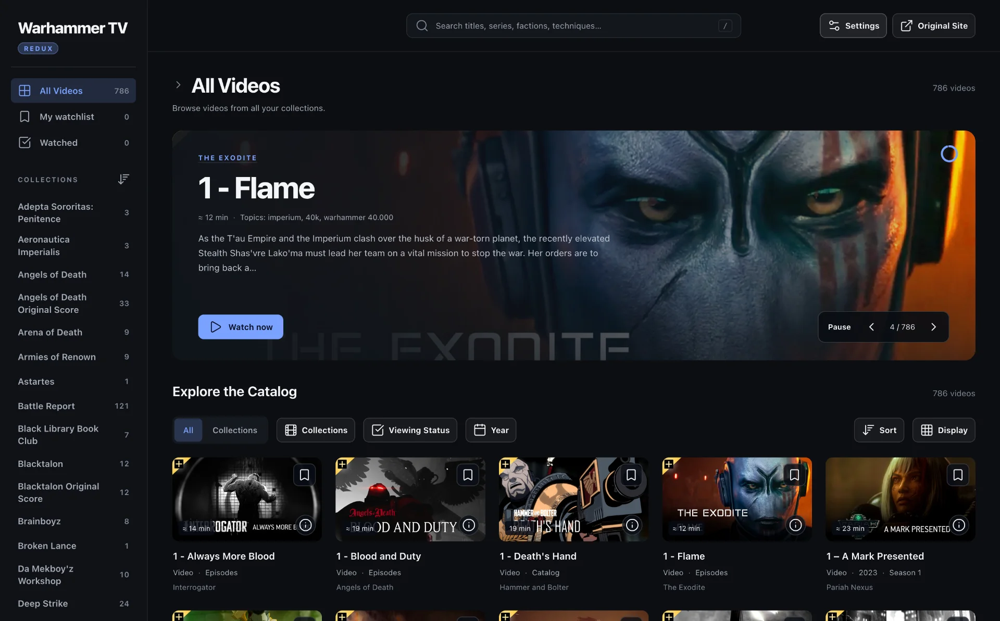
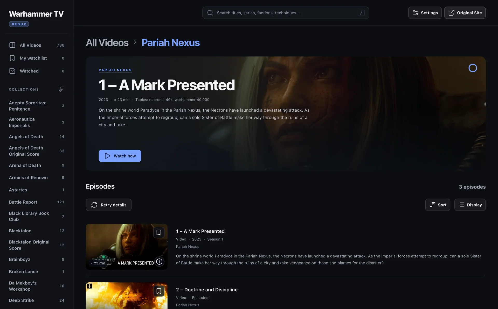
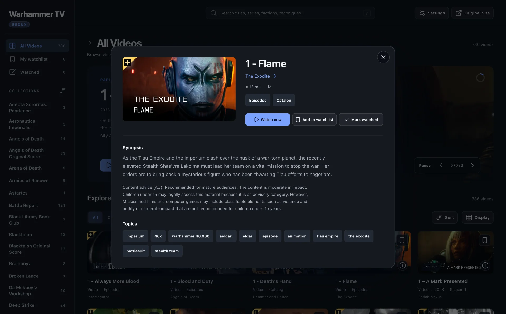

# Warhammer TV Redux

Warhammer TV Redux (WTV Redux) is a userscript that adds a searchable catalog overlay to Warhammer TV. It keeps
series metadata, watchlist and watched state, filters, and import/export tools in one place. The original player and
account controls remain unchanged.

> [!IMPORTANT]
> **Account and access notice**
>
> WTV Redux does not provide a Warhammer TV account, subscription, stream, or access to locked content. You need
> your own account and any subscription required by Warhammer TV. The script only organizes catalog data and metadata
> already exposed by the site or your browser session. It does not add unavailable data, bypass player access checks,
> or change playback permissions.

## How to Install

1. Install a userscript manager such as [Tampermonkey](https://www.tampermonkey.net/),
   [Violentmonkey](https://violentmonkey.github.io/), or Greasemonkey.
2. Download `WarhammerTV-Redux.user.js` from the [latest GitHub release](https://github.com/rvanhorn/wtv-redux/releases).
3. Open the file in your userscript manager and confirm the installation.
4. Open [Warhammer TV](https://www.warhammertv.com/). WTV Redux matches both the `www` and non-`www` site URLs.

For a local build, follow the setup steps in [Development](#development), run `pnpm run build`, and import
`dist/WarhammerTV-Redux.user.js` into your userscript manager.

Watchlist entries, watched marks, display preferences, and accent color stay in this browser. Use Settings > Export
to save a JSON backup. Import previews the file and merges valid entries without removing existing lists.

---

## Screenshots



_Browse all videos, collections, filters, sorting, and display options in one catalog._



_Open a series to view its metadata, episode count, recommendations, and episodes._



_Review synopsis, content guidance, topics, and watchlist actions before playback._

---

## Features

- Searchable All Videos, My Watchlist, Watched, and collection views.
- Series pages with season selection, episode counts, release metadata, and recommendations.
- Grid, compact, and detailed list layouts with filters and sorting.
- Settings for accent color, featured-banner visibility, catalog refresh, series recounting, and artwork refresh.
- JSON export and import for watchlist and watched data.
- A bundled series catalog that shows collection names, counts, and years before a collection is opened.

---

## Development

Requires Node.js 24 and pnpm 12.

Install dependencies and Playwright's Firefox build:

```bash
pnpm install --frozen-lockfile
pnpm exec playwright install firefox
```

### Local development

```bash
pnpm run dev
```

The command prints a local URL for `WTV-Redux-Dev-Loader.user.js`. Open the URL in Firefox and install the loader in
Greasemonkey or Tampermonkey. Disable the production userscript while the loader is enabled because both scripts
match the same pages.

Keep the command running while you edit. A successful build reloads an open Warhammer TV tab. A failed build keeps
the last successful bundle. The server listens only on `127.0.0.1`.

### Checks and tests

- `pnpm run check` checks JavaScript syntax, lint rules, and formatting.
- `pnpm run test:node` runs development-server and data tests.
- `pnpm run test:browser` builds the userscript and runs the deterministic Firefox suite with local fixtures.
- `pnpm run verify` runs the full check and test suite.

The browser suite does not contact the live service or require an account. If Firefox cannot start in the current
environment, run `pnpm run browser` from a normal terminal. Test commands connect to that browser while its endpoint
file exists. See `REPOSITORY.md` for the browser-server details.

### Build

```bash
pnpm run build
```

The build creates `dist/WarhammerTV-Redux.user.js`. The production userscript bundles the JavaScript and CSS and has
no runtime dependency on this repository or a development server.

---

## Releases

`package.json` owns the stable release version. The build writes that version into the userscript header.

1. Run `pnpm version patch --no-git-tag-version` or set the requested stable version. The `version` script refreshes
   `src/data/catalog.json`; if the refresh fails, run `pnpm run catalog:refresh` after fixing the cause.
2. Add one matching `## [version]` section to `CHANGELOG.md`.
3. Run `pnpm run verify`, commit the source and release files, and push to `main`.

GitHub Actions publishes `dist/WarhammerTV-Redux.user.js` when the package version increases and the matching
changelog section exists. The first push to a branch establishes its version baseline and does not publish a release.
Force pushes are not supported by the release detector.

---

## Data and privacy

- The homepage adapter uses the same-origin `/?_data=routes/_index` response and falls back to a DOM scan.
- Series requests use the browser's existing same-origin session.
- The script does not download media, replay third-party feed URLs, or bypass player access checks.
- Watchlist, watched, and preference data stays in browser storage unless you export it.
- The learned catalog is stored in same-origin IndexedDB. Clearing Warhammer TV site data or storage eviction can
  remove learned records.
- `pnpm run catalog:refresh` updates the bundled series catalog from the public homepage and series JSON routes. It
  runs during `pnpm version` and in the scheduled catalog-refresh workflow.
